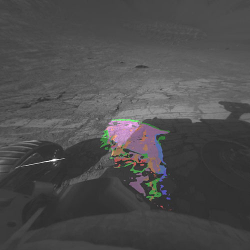

**COMPUTER SCIENCE IN MARS ROVER**

A TECHNICAL SEMINAR

Submitted

*In partial fulfillment of the requirement for the*

*Award of the degree of*

**BACHELOR OF TECHNOLOGY**

**in**

**COMPUTER SCIENCE & ENGINEERING**

**BY**

**SAIFUDDIN MOHAMMAD**

**14641A05H2**


**Department of Computer Science & Engineering**

**Vaagdevi College of Engineering**

**Accredited by National Board of Accreditation**

**(Affiliated to JNTU, Hyderabad)**

**Bollikunta, Warangal-506005,**

**(2014-2018)**

**CONTENTS PAGE NUMBER**

1.  INTRODUCTION 1

    1.  Search for life beyond Earth 4

    2.  The scientific objectives of the Mars mission 5

2.  COMPONENTS 6

2.1 Steering clear of danger: 6

2.2 Gaining Better Eyesight 7

2.3 Producing Range and Reachability Maps 8

1.  Enabling More Image Returns 9

2.  Instruments on Curiosity 10

3\. HARDWARE AND SOFTWARE 11

3.1 MSL FLIGHT COMPUTER. 12

3.2 Flight Software Overview 13

3.3 Modules used in a Rover 14

1.  Options for Changing Software in Flight 15

4\. PROGRAMMING OVERVIEW 17

4.1 WHY C++ 17

4.2 JPL Institutional Coding Standard for the C Programming Language 20

4.3 Conventions 22

4.4 Levels of Compliance 22

4.4.1 LOC-1: Language Compliance 23

4.4.2 LOC-2: Predictable Execution 25

4.4.3 LOC-3: Defensive Coding 29

4.4.4 LOC-4: Code Clarity 33

5\. Conclusion 37

6\. References 38

**LIST OF FIGURES**

**Name Page number**

1\. INTRODUCTION 1

2\. Navigation Display (Fig 2.1) 6

3\. The Panoramic Camera mast assembly (Fig 2.2) 7

4\. Reachability Map (Fig 2.3) 8

5\. Instruments on curiosity (Fig 2.5) 10

6\. Processor (Fig 3.1) 12

7\. Modules (Fig 3.2) 14

**LIST OF TABLES**

**Name Page number**

1.  VxWorks Overview (Table 3.1) 11

2.  Rule Summary Table(4.1) 21

3.  Rules of LOC Table(4.2) 23

4.  MISRA-C:2004 Rules Table(4.3) 23**  
    **

    **INTRODUCTION**

Image:
NASA (fig.1.1)

**1.1 Search for life beyond Earth.**

The rovers offer unique contributions in pursuit of the overall Mars
science strategy to "Follow the Water." Understanding the history of
water on Mars is important to meeting the [four science
goals](https://mars.nasa.gov/mer/science/goals.html) of NASA's long-term
Mars Exploration Program:

-   Determine whether Life ever arose on Mars

-   Characterize the Climate of Mars

-   Characterize the Geology of Mars

-   Prepare for Human Exploration

> **1.2 The scientific objectives of the Mars Exploration Rover mission
> are to:**

1.  Search for and characterize a variety of rocks and soils that hold
    clues to past water activity. In particular, samples sought will
    include those that have minerals deposited by water-related
    processes such as precipitation, evaporation, sedimentary
    cementation, or hydrothermal activity.

2.  Determine the distribution and composition of minerals, rocks, and
    soils surrounding the landing sites.

3.  Determine what geologic processes have shaped the local terrain and
    influenced the chemistry. Such processes could include water or wind
    erosion, sedimentation, hydrothermal mechanisms, volcanism, and
    cratering.

4.  Perform "ground truth" -- calibration and validation -- of surface
    observations made by Mars orbiter instruments. This will help
    determine the accuracy and effectiveness of various instruments that
    survey Martian geology from orbit.

5.  Search for iron-containing minerals, identify and quantify relative
    amounts of specific mineral types that contain water or were formed
    in water, such as iron-bearing carbonates.

6.  Characterize the mineralogy and textures of rocks and soils and
    determine the processes that created them.

7.  Search for geological clues to the environmental conditions that
    existed when liquid water was present. Assess whether those
    environments were conducive to life.

> **<u>2. COMPONENTS:</u>**

Software Engineering technologies provide the computing and commands
necessary to operate the spacecraft and its subsystems.

**2.1 Steering clear of danger:**

Building on Pathfinder's autonomy, the twin rovers are better able to
steer clear of danger. This mission marks the first implementation on a
flight vehicle of a new version of navigation and hazard-avoidance
software, developed at Carnegie Mellon University.

Two other embedded applications combine software and hardware
performance. First, a motor controller stabilizes the motors that
control elements like the rover wheels and the brushes on the rock
abrasion tool (RAT). Another first-time flight component is a
battery-controlled board that balances the charge on batteries, serves
as a nighttime computer and controls the clock.


Navigation Display (Fig 2.1)

This image shows the auto navigation display and highlights the many
paths that the rover considers as it faces an obstacle.  Ultimately, the
rover chooses the safest path.

**2.2 Gaining Better Eyesight**

A total of twenty cameras aid the twin rovers in their search for the
past presence of water on Mars and provide the world with stunning
images. The Mars Exploration Rover Mission provides the highest
resolution pictures of Mars yet.

Advances in technology led to smaller, more lightweight cameras, which
in turn allowed for nine cameras on each rover and one on each lander.
The rover cameras, all designed at JPL, are the most advanced cameras to
travel to another planet.

.

The Panoramic Camera mast assembly (Fig 2.2)

The panoramic camera mast assembly (PMA) serves as the rover's "neck"
and "head." Atop the "head" are the twin "eyes" of the panoramic camera
as well as those of the navigation camera.

**2.3 Producing Range and Reachability Maps**

Also new to this mission is the ability to produce a variety of
mission-aiding maps. Valuable tools for the science team, these maps
define range, reachability, slope and solar exposure. Stereo pictures
allow the image processing team to determine the 3-D location of each
pixel, giving them the exact location of features and rocks. Maps
developed from these data allow the science team to know how far the
rovers must travel to reach each object or if they are already in range
and able to reach out and touch it with the instrument deployment device



Reachability Map (Fig 2.3)

Reachability map created by JPL's Multimission Image Processing Lab
(MIPL) team to determine which points are reachable with the robotic
arm. Colors represent which areas are within reach of the various
science instruments.

In order to drive themselves the rovers take stereo images, from which
3-D terrain maps are generated automatically by the rover software.
Traversacbility and safety is then determined from the height and
density of rocks or steps, excessive tilts and roughness of the terrain.
Dozens of possible paths are considered before the rover chooses the
shortest, safest path toward the programmed geographical goal.

**2.4 Enabling More Image Returns**

A state of the art image compression system, also developed at JPL, has
allowed more images to be returned. The ICER wavelet-based image
compressor is able to take images that are 12 megabits and compress them
down to one megabit, thus taking up far less space on the memory card.
The compressor also divides each image into about 30 pieces,
significantly reducing the chance of losing an entire image when it is
sent back to Earth via the rover antennas and the [Deep Space
Network](http://deepspace.jpl.nasa.gov/dsn/).

**Cameras used for effective image returns across space:**

**–  Four Pairs of Engineering Hazard Avoidance Cameras (Hazcams):**

•  Mounted on the lower portion of the front and rear of the rover,
these black-and-white cameras use visible light to capture
three-dimensional (3-D) imagery.

**–  Two Pairs of Engineering Navigation Cameras (Navcams):**

•  Mounted on the mast (the rover "neck and head"), these
black-and-white cameras use visible light to gather panoramic,
three-dimensional (3D) imagery. The navigation camera unit is a stereo
pair of cameras, each with a 45-degree field of view

**–  Four Science Cameras:**

•  MastCam (one pair), will take color images, three-dimensional stereo
images, and color video footage

•  The Mars Hand Lens Imager is the equivalent of a geologist's hand
lens

•  Chemcam – Will fire a laser and analyze the elemental composition of
vaporized materials from areas smaller than 1 millimeter on the surface
of Martian rocks and soils.

1.  **Instruments on Curiosity**

> **ChemCam** – Will fire a laser and analyze the elemental composition
> of vaporized materials from areas smaller than 1 millimeter on the
> surface of Martian rocks and soils.

**• CheMin** –  The Chemistry and Mineralogy instrument, or CheMin for
short, will identify and measure the abundances of various minerals on
Mars.

•  **SAM** –  The Sample Analysis at Mars features chemical equipment
found in many scientific laboratories on Earth. SAM will search for
compounds of the element carbon.

•  **REMS** –  A weather monitoring station

•  **RAD3** –  Measures radiation


Instruments on curiosity (Fig 2.5)

1.  **<u>HARDWARE AND SOFTWARE</u>**

<table>
<thead>
<tr class="header">
<th></th>
<th></th>
<th></th>
<th></th>
<th></th>
<th></th>
<th></th>
<th></th>
<th></th>
<th></th>
<th></th>
<th></th>
<th></th>
<th></th>
<th></th>
<th></th>
<th><p>It's running <a href="http://compass.informatik.rwth-aachen.de/ws-slides/havelund.pdf">2.5 million lines of C</a> on a <a href="http://www.baesystems.com/product/BAES_028145/rad750-family-of-products">RAD750 processor</a> manufactured by <a href="http://www.baesystems.com/home">BAE</a>. The <a href="http://marsprogram.jpl.nasa.gov/msl/mission/rover/brains/">JPL</a> has a bit more information but I do suspect many of the details are not publicized. It does appear that the testing scripts were written in Python.</p>
<p>The underlying operating system is <a href="http://www.windriver.com/news/press/pr.html?ID=10901">Wind River's</a> <a href="http://windriver.com/products/vxworks/">VxWorks RTOS</a>. The <a href="http://windriver.com/products/product-overviews/PO_VE_6_9_Platform_0211.pdf">RTOS</a> in question can be programmed in C, C++, Ada or Java. However, only C and C++ are standard to the OS, Ada and Java are supported by extensions. Wind River supplies a tremendous amount of detail as to the hows and whys of <a href="http://www.windriver.com/products/product-notes/PN_VE_6_9_Platform_0311.pdf">VxWorks</a>.</p>
<p>The underlying chipset is almost absurdly <a href="http://news.cnet.com/8301-11386_3-57491281-76/slow-but-rugged-curiositys-computer-was-built-for-mars/">robust</a>. Its specs may not seem like much at first but it is allowed to have one and only one "blue screen" every 15 years. Bear in mind, this is under bombardment from radiation that would kill a human many times over. In space, robustness wins out over speed. Of course, robustness like that comes at a cost. In this case, it's a cool $200,000 to $500,000.</p></th>
</tr>
</thead>
<tbody>
<tr class="odd">
<td></td>
<td></td>
<td></td>
<td></td>
<td></td>
<td></td>
<td></td>
<td></td>
<td></td>
<td></td>
<td></td>
<td></td>
<td></td>
<td></td>
<td></td>
<td></td>
<td>VxWorks Overview (Table 3.1)</td>
</tr>
</tbody>
</table>

| Developer        | Wind River(a wholly owned subsidiary of Intel Corporation)   |
|------------------|--------------------------------------------------------------|
| OS Family        | Real-time operating systems                                  |
| Working State    | Current                                                      |
| Initial Release  | 1987; 30 years ago                                           |
| Latest release   | 7/ March 2014; 3 years ago                                   |
| Marketing target | Embedded systems                                             |
| Platforms        | X86(including Intel Quark), X86-64, MIPS, PowerPC, SH-4, ARM |
| Kernel type      | Monolithic                                                   |
| License          | Proprietary                                                  |
| Official website | http://www.windriver.com/products/vxworks/                   |

**3.1 MSL FLIGHT COMPUTER.**

Single Board Computer

**–  RAD 750**

•  On-board memory includes 128 MB of volatile DRAM

•  4 GB of NAND non-volatile memory on a separate card

•  Both with error detection and correction

•  Runs on two flight computers 

-   Prime and Backup


> Processor (Fig 3.1)
>
> **3.2 Flight Software Overview**

Why C++ was late to space exploration? Reason for that, even the C++ has
been around for over a decade, missions are always really reluctant to
embrace change, they don’t want change for change’s sake, and in order
to minimize risk, they want to pick a solution that is based on flight
heritage. So there is presumed to be less risk to use the same kind of
approach that was used already successfully on a prior mission. So it’s
really hard to throw new things into that paradigm.

But repeated comparison and retesting proved that C++ is more effective
and efficient in space flight. It’s the right solution because

-   Saved time in getting the code working.

-   Helped in developing flight software

-   Test more make more changes

-   Support the overall framework quickly, effectively and safely.

Most of it is based upon the automatic interpretation of stereo pairs of
images taken by rover as it moves across the surface of Mars.

Either for safe driving, looking to see where you’re about to drive and
avoiding any rocks, slopes or ditches or rough areas. Measuring
position, tracking something that is drive by. It’s all about the
cameras and autonomous image processing that goes into it.

*“NASA’s Mars Exploration Rovers were designed to survive 90 days. But
Spirit explored Mars for 6 years! A stalled wheel motor led to a
serendipitous discovery proving Mars had freestanding pools of water.
FSW patches helped keep Spirit going even with failed actuators.”*

**3.3 Modules used in a Rover:**


Modules (Fig 3.2)

All run Vxworks operating system

-   Supports executing shell commands

-   Change variables

-   Dynamic code loading and execution

<!-- -->

-   MSL has over 100 flight software modules, most run as their own task

-   Communicating between tasks IPC(Inter process communication)

<!-- -->

-   Send a message

-   Wait for reply

-   Proceed

**3.4 Options for Changing Software in Flight**

-   Uplink and install an entire flight software image

•  Patch an existing flight software image

–  Modify or extend the existing onboard flight software image

•  Extend FSW with a new software component

– Dynamically load new code

–  Add a new .o and add new commands, telemetry, and data products using
a FSW-provided API

**Why Patch?**

**Patching can:**

–  Add entirely new functionality to flight software

• Could include new commands and telemetry

•  May be necessary to work around newly discovered hardware behavior

•  Increase science return

–  Fix a flight software bug

•  patching potentially a faster process than a full FSW image

–  A full FSW load typically requires that Validation and Verification
(V&V) tests run against all FSW capabilities, even ones that are not
changing.

**General Patching Approaches**

**•  Hot patch**

–  Changes code in RAM while we are running

–  VxWorks also allows dynamic loading of .o files

**•  Cold patch**

–  Modify the flight software image stored in a non-volatile storage
area.

–  The new code image would be used on a subsequent boot

–  Does not change the currently running code

-   Patches may need to

–  Add code to an existing function

–  Replace a buggy function with a new function

–  Remove code from an existing function

–  Add new global variables

–  Change or assign references to existing global variables, e.g.
function pointers

–  Add new commands and telemetry

•  And just in case the patch doesn’t work

–  Have a plan for un-installing the patch

**How A Full New Image is installed**

•  The ground uplinks a new binary image to the file system

•  Upon command, the new image is saved

–  Flight software loads the image into RAM

–  Flight software burns the NOR zone with the image

•  MER

–  In addition to the above, MER also allowed patching the RAM image
before burning to its nonvolatile storage in EEPROM

**Adding new functionality**

•  MSL can add new functionality

–  Special commands can install a new FSW component .o containing new
code, commands, telemetry

•  Registration to add new functionality

–  The new .o is dynamically loaded during the boot process

–  The new code may register new commands, telemetry, data products

–  The new code can hook into the existing wakeup and shutdown process

•  Functions are registered.

–  The registration is performed once

•  Registration information is stored in non-volatile memory

*“Opportunity is now in its 12<sup>th</sup> year of Mars Exploration!
Opportunity holds the distance record for roving across a planetary
surface (over 42km), there have been 6 major FSW updates and tens of hot
or cold patches.”*

1.  **<u>PROGRAMMING OVERVIEW</u>**

**4.1 WHY C++?**

Through 1990’s, JPL researchers used c++ to develop high level
autonomous behaviours like stereo vision, map building, path planning
and visual odometry.

C++ class abstraction and encapsulation enabled rapid development and
testing among multiple projects and developers. Many capabilities were
field-tested and field-proved over years of testing.

**Class Abstraction**: An abstract class is a class that is designed to
be specifically used as a baseclass. An abstract class contains at least
one pure virtual function. You declare a pure virtual function by using
a pure specifier ( = 0 ) in the declaration of a virtual member function
in the class declaration.

//c++ program to explain

//Abstraction

```\#include &lt;iostream&gt;

using namespace std;

class implementAbstraction

{

private:

int a, b;

public:

// method to set values of

// private members

void set(int x, int y)

{

a = x;

b = y;

}

void display()

{

cout&lt;&lt;"a = " &lt;&lt;a &lt;&lt; endl;

cout&lt;&lt;"b = " &lt;&lt; b &lt;&lt; endl;

}

};

int main()

{

implement Abstraction obj;

obj.set(10, 20);

obj.display();

return 0;

}

Run on IDE ```

Output:

a = 10

b = 20

**Encapsulation**: is an Object Oriented Programming concept that binds
together the data and functions that manipulate the data, and that keeps
both safe from outside interference and misuse. Data encapsulation led
to the important OOP concept of data hiding.

// c++ program to explain

// Encapsulation

\#include&lt;iostream&gt;

using namespace std;

class Encapsulation

{

private:

// data hidden from outside world

int x;

public:

// function to set value of

// variable x

void set(int a)

{

x =a;

}

// function to return value of

// variable x

int get()

{

return x;

}

};

// main function

int main()

{

Encapsulation obj;

obj.set(5);

cout&lt;&lt;obj.get();

return 0;

}

OUTPUT – 5

*“Abstraction of classes provided the freedom of not only working
together with all modules but also working independently on separate
modules, in turn more robustly programs are executed”*

**4.2 JPL Institutional Coding Standard for the C Programming Language**

Considerable efforts have been invested by many different organizations
in the past on the development of coding standards for the C programming
language. The intent of this standard is not to duplicate the earlier
work but to collect the best available insights in a form that can help
us improve the safety and reliability of our code. By conforming to a
single institutional standard, rather than maintaining a multitude of
project and mission specific standards, we can achieve greater
consistency of code quality at JPL.

Two earlier efforts have most influenced the contents of this standard.
The first is the MISRA-C coding guideline from 2004, 1 which was
originally defined for the development of embedded C code in
automobiles, but is today used broadly for safety critical applications.
The second source is the set of coding rules known as the “Power of
Ten.” 2 Neither of these two sources, though, addresses software risks
that are related to the use of multi-threaded software. This standard
aims to fill that void.

This rules included in this standard, and the tools and processes that
are used to verify code compliance, should be reviewed for possible
revision no more than once per year and no less than once per five
years.

Many software experts both inside and outside JPL have contributed to
the creation of this document with proposals for good coding rules, and
critiques of those contained in earlier standards.

**4.2 Rule Summary**

1 Language Compliance

1.  Do not stray outside the language definition.

2.  Compile with all warnings enabled; use static source code analyzers.

2 Predictable Execution

1.  Use verifiable loop bounds for all loops meant to be terminating.

2.  Do not use direct or indirect recursion.

3.  Do not use dynamic memory allocation after task initialization. \*6
    > Use IPC messages for task communication.

<!-- -->

1.  Do not use task delays for task synchronization.

> \*8 Explicitly transfer write-permission (ownership) for shared data
> objects.

1.  Place restrictions on the use of semaphores and locks.

<!-- -->

1.  Use memory protection, safety margins, barrier patterns.

2.  Do not use goto, setjmp or longjmp.

3.  Do not use selective value assignments to elements of an enum list.

3 Defensive Coding

1.  Declare data objects at smallest possible level of scope.

2.  Check the return value of non-void functions, or explicitly cast to
    > (void).

3.  Check the validity of values passed to functions.

> 16 Use static and dynamic assertions as sanity checks.
>
> \*17 Use U32, I16, etc instead of predefined C data types such as int,
> short, etc.

1.  Make the order of evaluation in compound expressions explicit.

2.  Do not use expressions with side effects.

4 Code Clarity

1.  Make only very limited use of the C pre-processor.

2.  Do not define macros within a function or a block.

3.  Do not undefine or redefine macros.

4.  Place \#else, \#elif, and \#endif in the same file as the matching
    > \#if or \#ifdef. \*24 Place no more than one statement or
    > declaration per line of text.

> \*25 Use short functions with a limited number of parameters. \*26 Use
> no more than two levels of indirection per declaration.
>
> \*27 Use no more than two levels of dereferencing per object
> reference. \*28 Do not hide dereference operations inside macros or
> typedefs. \*29 Do not use non-constant function pointers.

1.  Do not cast function pointers into other types.

2.  Do not place code or declarations before an \#include directive.

5 – MISRA *shall* compliance

> 73 All MISRA *shall* rules not already covered at Levels 1-4. rules

6 – MISRA *should* compliance

> \*16 All MISRA *should* rules not already covered at Levels 1-4. rules

\*) All rules are *shall* rules, except those marked with an asterix.
Table(4.1)

**4.3 Conventions**

The use of the verbs *shall* and *should* have the following meaning in
this document.

-   *Shall* indicates a requirement that must be followed, with
    compliance verified.

-   *Should* indicates a preference that must be addressed, but with
    deviations allowed, provided that an adequate justification is given
    for each deviation.

An effort is made to limit *shall* rules to cases for which compliance
can effectively be verified (e.g., with tool-based checks). If a
deviation from a *shall* rule is sought, substantial supporting evidence
must be provided in a written waiver request. Such waiver requests must
be evaluated by a team of software experts from across JPL, not
associated with the project seeking the waiver.<sup>5</sup>

For each rule given, the most closely related rule in the MISRA-C:2004
standard or the Power of Ten rule-set is quoted.

1.  **Levels of Compliance**

This standard defines six levels of compliance (LOC), ranging from the
most general to the most specific. Compliance with this standard can be
certified for each level separately, preferably with the help of
tool-based compliance checkers. It is also possible to certify
compliance at different LOC levels for different parts of a large code
base. For newly written code, achieving full compliance with this
standard – at least through level 4, is not expected to have a
measurable impact on schedule or cost. This trade-off can be different
for heritage code, developed before this standard went into effect. For
existing code, the amount of effort needed to achieve compliance will
increase with each new level. Schedule and cost considerations, weighed
against mission risk, should determine which level is appropriate.
Levels of compliance certification for each project or mission should be
defined in the project’s Software Management Plan (SMP).

The number of rules defined at each LOC is summarized in the following
Table. The name of each segment is meant to be suggestive of its
approximate purpose.

<table>
<tbody>
<tr class="odd">
<td><blockquote>
<p><strong>Level of Compliance</strong></p>
</blockquote></td>
<td><strong>Rules Defined</strong></td>
<td><strong>Cumulative Number of Rules</strong></td>
<td></td>
</tr>
<tr class="even">
<td></td>
<td><strong>at Level</strong></td>
<td><strong>Required for Full Compliance</strong></td>
<td></td>
</tr>
<tr class="odd">
<td></td>
<td></td>
<td></td>
<td></td>
</tr>
<tr class="even">
<td><blockquote>
<p>LOC-1 Language Compliance</p>
</blockquote></td>
<td>2</td>
<td>2</td>
<td></td>
</tr>
<tr class="odd">
<td><blockquote>
<p>LOC-2 Predictable Execution</p>
</blockquote></td>
<td>10</td>
<td>12</td>
<td></td>
</tr>
<tr class="even">
<td><blockquote>
<p>LOC-3 Defensive Coding</p>
</blockquote></td>
<td>7</td>
<td>19</td>
<td></td>
</tr>
<tr class="odd">
<td><blockquote>
<p>LOC-4 Code Clarity</p>
</blockquote></td>
<td>12</td>
<td>31</td>
<td></td>
</tr>
<tr class="even">
<td><blockquote>
<p>LOC-5 MISRA-shall rules</p>
</blockquote></td>
<td>73</td>
<td>104</td>
<td></td>
</tr>
<tr class="odd">
<td><blockquote>
<p>LOC-6 MISRA-should rules</p>
</blockquote></td>
<td>16</td>
<td>120</td>
<td></td>
</tr>
</tbody>
</table>

The rules defined at LOC-1 through LOC-4 correspond to the following
MISRA-C and Power of Ten rules. (Table 4.2)

<table>
<tbody>
<tr class="odd">
<td><blockquote>
<p><strong>Level of Compliance</strong></p>
</blockquote></td>
<td><blockquote>
<p><strong>MISRA-C:2004 Rules</strong></p>
</blockquote></td>
<td><blockquote>
<p><strong>Power of</strong></p>
</blockquote></td>
</tr>
<tr class="even">
<td></td>
<td></td>
<td><blockquote>
<p><strong>Ten Rules</strong></p>
</blockquote></td>
</tr>
<tr class="odd">
<td><blockquote>
<p>LOC-1 Language Compliance</p>
</blockquote></td>
<td><blockquote>
<p>1.1, 1.2, 2.3, 21.1</p>
</blockquote></td>
<td><blockquote>
<p>1, 10</p>
</blockquote></td>
</tr>
<tr class="even">
<td><blockquote>
<p>LOC-2 Predictable Execution</p>
</blockquote></td>
<td><blockquote>
<p>9.3, 14.4, 16.2, 20.4</p>
</blockquote></td>
<td><blockquote>
<p>2, 3</p>
</blockquote></td>
</tr>
<tr class="odd">
<td><blockquote>
<p>LOC-3 Defensive Coding</p>
</blockquote></td>
<td><blockquote>
<p>6.3, 8.7, 8.10, 12.2, 13.1, 16.10, 20.3</p>
</blockquote></td>
<td><blockquote>
<p>5, 6, 7</p>
</blockquote></td>
</tr>
<tr class="even">
<td><blockquote>
<p>LOC-4 Code Clarity</p>
</blockquote></td>
<td><blockquote>
<p>11.1, 16.1, 17.5, 19.1, , 19.4 19.5, 19.6,</p>
</blockquote></td>
<td><blockquote>
<p>4, 8, 9</p>
</blockquote></td>
</tr>
<tr class="odd">
<td></td>
<td><blockquote>
<p>19.12, 19.13, 19.17</p>
</blockquote></td>
<td></td>
</tr>
</tbody>
</table>

(Table 4.3)

> **4.4.1 LOC-1: Language Compliance**
>
> **Rule 1 (language)**
>
> All C code *shall* conform to the ISO/IEC 9899-1999(E) standard for
> the C programming language, with no reliance on undefined or
> unspecified behavior. \[MISRA-C:2004 Rule 1.1, 1.2\]

The purpose of this rule is to make sure that all mission critical code
can be compiled with any language compliant compiler, can be analyzed by
a broad range of tools, and can be understood, debugged, tested, and
maintained by any competent C programmer. It ensures that there is no
hidden reliance on compiler or platform specific behavior that may
jeopardize portability or code reuse. The rule prohibits straying
outside the language definition, and forbids reliance of undefined or
unspecified behavior. This rule also prohibits the use of \#pragma
directives, which are by definition implementation defined and outside
the language proper. The \#error directive is part of the language, and
its use is supported. The closely related \#warning directive is not
defined in the language standard, but its use is allowed if supported by
the compiler (but note Rule 2).

The C language standard explicitly recognizes the existence of undefined
and unspecified behavior. A list of formally unspecified, undefined and
implementation dependent behavior in C, as contained in the ISO/IEC
standard definition, is given in Appendix A.

> **Rule 2 (routine checking)**
>
> All code *shall* always be compiled with all compiler warnings enabled
> at the highest warning level available, with no errors or warnings
> resulting. All code *shall* further be verified with a JPL approved
> state-of-the-art static source code analyzer, with no errors or
> warnings resulting. \[MISRA-C:2004 Rule 21.1\]

This rule should be considered routine practice, even for *non*-critical
code development. Given compliance with Rule 1, this means that the code
should compile without errors or warnings issued with the standard gcc
compiler, using a command line with minimally the following option
flags:

> gcc –Wall –pedantic –std=iso9899:1999 source.c

A suggested broader set of gcc compiler flags includes also:

> -Wtraditional -Wshadow -Wpointer-arith -Wcast-qual -Wcast-align
> -Wstrict-prototypes -Wmissing-prototypes -Wconversion

The rule of zero warnings applies even in cases where the compiler or
the static analyzer gives an erroneous warning. If the compiler or the
static analyzer gets confused, the code causing the confusion should be
rewritten so that it becomes more clearly valid. Many developers have
been caught in the assumption that a tool warning was false, only to
realize much later that the message was in fact valid for less obvious
reasons. The JPL recommended static analyzers are fast, and produce
sparse and accurate messages.

**4.4.2 LOC-2: Predictable Execution**

**Rule 3 (loop bounds)**

All loops shall have a statically determinable upper-bound on the
maximum number of loop iterations. It shall be possible for a static
compliance checking tool to affirm the existence of the bound. An
exception is allowed for the use of a single non-terminating loop per
task or thread where requests are received and processed. Such a server
loop shall be annotated with the C comment: /\* @non-terminating@ \*/.

\[Power of Ten Rule 2\]

**Rule 4 (recursion)**

There shall be no direct or indirect use of recursive function calls.
\[MISRA-C:2004 Rule 16.2; Power of Ten Rule 1\]

The presence of statically verifiable loop bounds and the absence of
recursion prevent runaway code, and help to secure predictable
performance for all tasks. The absence of recursion also simplifies the
task of deriving reliable bounds on stack use. The two rules combined
secure a strictly acyclic function call graph and control-flow
structure, which in turn enhances the capabilities for static checking
tools to catch a broad range of coding defects.

One way to enforce secure loop bounds is to add an explicit upper-bound
to all loops that can have a variable number of iterations (e.g., code
that traverses a linked list). When the upper-bound is exceeded an
assertion failure and error exit can be triggered. For standard
for-loops, the loop bound requirement can be satisfied by making sure
that the loop variables are not referenced or modified inside the body
of the loop.

**Rule 5 (heap memory)**

There shall be no use of dynamic memory allocation after task
initialization. \[MISRA-C:2004 Rule 20.4; Power of Ten Rule 3\]

Specifically, this rule disallows the use of malloc(), sbrk(), alloca(),
and similar routines, after task initialization.

This rule is common for safety and mission critical software and appears
in most coding guidelines. The reason is simple: memory allocators and
garbage collectors often have unpredictable behavior that can
significantly impact performance. A notable class of coding errors stems
from mishandling memory allocation and free routines: forgetting to free
memory or continuing to use memory after it was freed, attempting to
allocate more memory than physically available, overstepping boundaries
on allocated memory, using stray pointers into dynamically allocated
memory, etc. Forcing all applications to live within a fixed,
pre-allocated, area of memory can eliminate many of these problems and
make it simpler to verify safe memory use.

**Rule 6 (inter-process communication)**

An IPC mechanism *should* be used for all task communication. Callbacks
*should* be avoided. No task *should* directly execute code or access
data that belongs to a different task. All IPC messages *shall* be
received at a *single* point in a task.

Communication and data exchanges between different tasks (modules) in
the system are best performed through a disciplined use of IPC
(inter-process communication) messaging. IPC messages should then
contain only data, preferably no data pointers, and *never* any function
pointers. Each task or module should maintain its own data structures,
and not allow direct access to local data by other tasks. This style of
software architecture is based on principles of software modularity,
data hiding, and the separation of concerns that can avoid the need for
the often more error-prone use of semaphores, interrupt masking and data
locking to achieve task synchronization.

**Rule 7 (thread safety)**

Task synchronization *shall not* be performed through the use of task
delays.

Specifically the use of task delays has been the cause of race
conditions that have jeopardized the safety of spacecraft. The use of a
task delay for task synchronization requires a guess of how long certain
actions will take. If the guess is wrong, havoc, including deadlock, can
be the result.

**Rule 8 (access to shared data)**

Data objects in shared memory *should* have a single owning task. Only
the owner of a data object *should* be able to modify the object.
Ownership *should* be passed between tasks explicitly, preferably via
IPC messages.

Ownership equals write-permission, but non-ownership generally will not
exclude read-access to a shared object. Note that this rule does not
prevent the use of system-wide library modules that are not associated
with any one task, but it does place a restriction on how tasks use such
modules. Generally, if a shared object does not have a single owning
task, access to that object has to be regulated with the use of locks or
semaphores, to avoid access conflicts that can lead to data corruption.

**Rule 9 (semaphores and locking)**

The use of semaphores or locks to access shared data *should* be avoided

(cf. Rules 6 and 8). If used, nested use of semaphores or locks *should*
be avoided. If such use is unavoidable, calls *shall* always occur in a
single predetermined, and documented, order. *Unlock* operations *shall*
always appear within the body of the same function that performs the
matching *lock* operation.

Semaphore *acquire* and *release* operations, when used for locking, and
interrupt *mask* and *unmask* operations, should always appear in pairs,
within the same function, to comply with the second part of Rule 9.
Semaphore operations can also validly be used for “*producer-consumer*”
synchronization. In those cases *acquire* and *release* operations may
appear in different tasks. The use of nested semaphore or locking calls
in more than one possible order can cause deadlock.

**Rule 10 (memory protection)**

Where available, i.e., when supported by the operating system, memory
protection shall be used to the maximum extent possible. When not
available, safety margins and barrier patterns shall be used to allow
detection of access violations.

For instance, an area of memory above the stack limit allocated to each
task should be reserved as a safety margin, and filled with a fixed and
uncommon bit-pattern. A health task can detect stack overflow anomalies
by at regular intervals checking the presence of the bit-pattern for
each task. The same principle can be used to protect against buffer
overflow, or access to memory outside allocated regions. Critical
parameters should similarly be protected in memory by placing safety
margins and barrier patterns around them, so that access violations and
data corruption can be detected more easily.

**Rule 11 (simple control flow)**

The goto statement shall not be used. There shall be no calls to the
functions setjmp or longjmp. \[MISRA-C:2004, Rule 14.4, Power of Ten
Rule 1\]

Simpler control flow translates into stronger capabilities for both
human and tool-based analysis and often results in improved code
clarity. Mission critical code should not just be arguably, but
trivially correct.

**Rule 12 (enum Initialization)**

In an enumerator list, the "=" construct shall not be used to explicitly
initialize members other than the first, unless all items are explicitly
initialized. \[MISRA-C:2004, Rule 9.3\]

**4.4.3 LOC-3: Defensive Coding**

**Rule 13 (limited scope)**

Data objects shall be declared at the smallest possible level of scope.
No declaration in an inner scope shall hide a declaration in an outer
scope.

\[MISRA-C:2004 Rule 8.7, 8.10; Power of Ten Rule 6\]

This rule supports a well-known principle of data-hiding. If an object
is not in scope, its value cannot be referenced or corrupted. Similarly,
if an erroneous value of an object has to be diagnosed, the fewer the
number of statements where the value could have been assigned; the
easier it is to diagnose the problem. The rule discourages the re-use of
variables for multiple, incompatible purposes, which complicates fault
diagnosis.

The rule is consistent with the principle of preferring pure functions
that do not touch global data, that avoid storing local state, and that
do not modify data declared in the calling function indirectly. The use
of distributed state information can significantly reduce code
transparency, reduce the effectiveness of standard software test
strategies, and complicate the debugging process if anomalies occur.
Good programming practice is further to prefer the use of immutable data
objects and references. This means that data objects should by
preference be declared of C type enum or with the C qualifier const.
Especially function parameters should be declared with the type
qualifier const wherever possible.

Although their use is sometimes unavoidable, there is a hidden danger in
the use of extern declarations in C. Without precautions, if we declare
a global data object named x as type A (e.g., int) in one source file,
and then place an extern declaration to the same object x in another
source file, while accidentally using another type B (e.g., double),
most current compilers (including gcc with all warnings enabled at the
highest setting) and most current static analyzers, will not detect the
type inconsistency. Clearly, if the two types have different size (as in
our example of int and double) havoc will result (mitigated only
partially by the use of barrier patterns, as recommended in Rule 10).
The correct remedy for this significant flaw in current compiler
technology is to:

Place all extern declarations in a header file. The header file must be
included in every file that refers to the corresponding data object:
both the source file in which the actual declaration appears and the
files in which the object is used.

If this rule is followed, the compiler will be able to flag all type
inconsistencies reliably. Note the similarity in this treatment of
extern declarations and the standard use of function prototypes (which
follows very similar rules).

**Rule 14 (checking return values)**

The return value of non-void functions shall be checked or used by each
calling function, or explicitly cast to (void) if irrelevant.
\[MISRA-C:2004 Rule 16.10; Power of Ten Rule 7\]

**Rule 15 (checking parameter values)**

The validity of function parameters *shall* be checked at the start of
each public function. The validity of function parameters to other
functions *shall* be checked by either the function called or by the
calling function. \[MISRA-C:2004 Rule 20.3; Power of Ten Rule 7\]

This is consistent with the principle that the use of *total* functions
is preferable over non-total functions. A total function is setup to
handle *all* possible input values, not just those parameter values that
are expected when the software functions normally.

**Rule 16 (use of assertions)**

Assertions *shall* be used to perform basic sanity checks throughout the
code. All functions of more than 10 lines *should* have at least one
assertion. \[Power of Ten Rule 5\]

Assertions are used to check for anomalous conditions that should never
happen in real-life executions. Assertions must be side-effect free and
can be defined as Boolean tests. When an assertion fails, an explicit
recovery action should be taken, e.g., by returning an error condition
to the caller of the function. No assertion should be used for which a
static checking tool can prove that it can never fail or never hold.

Statistics for industrial coding efforts indicate that unit tests often
find at least one defect per one hundred lines of code written. The odds
of intercepting defects increase with a liberal use of assertions.
Assertions can be used to verify pre- and post-conditions of functions,
parameter values, and expected function return values, and
loop-invariants. Because assertions are side-effect free, they can be
selectively disabled after testing in performance-critical code. A
recommended use of assertions is to follow the following pattern:

> if (!c\_assert(p &gt;= 0) == true) { return ERROR;
>
> }

where the assertion is defined during testing as:

> \#define c\_assert(e) ((e) ? (true) : \\ tst\_debugging("%s,%d:
> assertion '%s' failed\\n", \\ \_\_FILE\_\_, \_\_LINE\_\_, \#e), false)

In this definition, \_\_FILE\_\_ and \_\_LINE\_\_ are predefined by the
macro preprocessor to produce the filename and line-number of the
failing assertion. The syntax \#e turns the assertion condition e into a
string that is printed as part of the error message. Because in flight
there is no convenient place to print an error message, the call to
tst\_ debugging can be turned into a call to a different error-logging
routine after testing. In flight, the assertion then turns into a
Boolean test that protects, and enables recovery, from anomalous
behavior, automatically logging every violation encountered.

The examples above are for *dynamic* assertions that can provide
protection against unexpected conditions encountered at runtime. An even
stronger check can be provided by *static* assertions that can be
evaluated by the compiler at the time code is compiled. A static
assertion can be defined like the c\_assert above, but can be used
standalone (i.e., not in a conditional), for instance as follows:

c\_assert( 1 / ( 4 – sizeof(void \*));

This assertion will trigger a “division by zero” warning from the
compiler when the code is compiled on 32-bit machines (thus triggering
Rule 2). To check the opposite requirement, i.e., to make sure that we
are executing on a 32-bit machine only, the following static assertion
can be used:

c\_assert( 1 / (sizeof(void \*) & 4) );

This version will trigger the “division by zero” warning from the
compiler when the code is compiled on machines that do *not* have a
32-bit wordsize.

**Rule 17 (types)**

Typedefs that indicate size and signedness *should* be used in place of
the basic types. \[MISRA-C:2004 Rule 6.3\]

This rule appears in most coding standards for embedded software and is
meant to enhance code transparency and secure type safety. Typical
definitions include I32 for signed 32-bit integer variables, U16 for
unsigned 16-bit integer variables, etc.

**Rule 18**

In compound expressions with multiple sub-expressions the intended order
of evaluation *shall* be made explicit with parentheses. \[cf.
MISRA-C:2004 Rule 12.2\]

**Rule 19**

The evaluation of a Boolean expression *shall* have no side effects.

\[MISRA-C:2004 Rule 13.1\]

**4.4.4 LOC-4: Code Clarity**

Especially mission critical code should be written to be readily
understandable by any competent developer, without requiring significant
effort to reconstruct the thought processes and assumptions of the
original developer. The rules in this section aim to secure compliance
with this requirement.

The purpose of these rules is that all code remains readily
understandable and maintainable, also years after it is written, and
especially when examined under time pressure and by anyone other than
the original developer. Code does not just serve to communicate a
developer’s intent to a computer, but also to current and future
colleagues that must be able to maintain, revise, or extend the code
reliably. Code clarity cannot easily be captured in a comprehensive set
of mechanically verifiable checks, so the specific rules included here
serve primarily as examples of safe coding practice.

**Rule 20 (preprocessor use)**

Use of the C preprocessor *shall* be limited to file inclusion and
simple macros.

\[Power of Ten Rule 8\]

The C preprocessor is a powerful obfuscation tool that can destroy code
clarity and befuddle both human- and tool-based checkers. The effect of
constructs in unrestricted preprocessor code can be extremely hard to
decipher, even with a formal language definition in hand. In new
implementations of the C preprocessor, developers often have to resort
to using earlier implementations as the referee for interpreting complex
defining language in the C standard.

Specifically, the use of token pasting (cf. MISRA-C:2004 Rules 19.12 and
19.13), variable argument lists (ellipses) (cf. MISRA-C:2004 Rule 16.1),
and recursive macro calls are excluded by this rule. All macros are
required to expand into complete syntactic units (cf. MISRA-C:2004 Rule
19.4).

The use of conditional compilation directives (\#ifdef, \#if, \#elif)
should be limited to the standard boilerplate that avoids multiple
inclusion of the same header file in large projects. (See also Rule 23.)
There is rarely a justification for the use of other conditional
compilation directives even in large software development efforts. Each
such use should be justified in the code. Note that with just ten
conditional compilation directives, there could be up to 2<sup>10</sup>
(i.e., 1024) possible versions of the code, each of which would have to
be tested – causing a generally unaffordable increase in the required
test effort.

**Rule 21 (preprocessor use)**

Macros *shall not* be \#define'd within a function or a block.
\[MISRA-C:2004 Rule 19.5\]

**Rule 22 (preprocessor use)**

\#undef *shall not* be used. \[MISRA-C:2004 Rule 19.6\]

**Rule 23 (preprocessor use)**

All \#else, \#elif and \#endif preprocessor directives *shall* reside in
the same file as the \#if or \#ifdef directive to which they are
related. \[MISRA-C:2004 Rule 19.17\]

**Rule 24**

There *should* be no more than one statement or variable declaration per
line. A single exception is the C for-loop, where the three controlling
expressions (initialization, loop bound, and increment) can be placed on
a single line.

**Rule 25**

Functions *should* be no longer than 60 lines of text and define no more
than 6 parameters. \[Power of Ten Rule 4\]

A function should not be longer than what can be printed on a single
sheet of paper in a standard reference format with one line per
statement and one line per declaration. Typically, this means no more
than about 60 lines of code per function. Long lists of function
parameters similarly compromise code clarity and should be avoided.

Each function should be a logical unit in the code that is
understandable and verifiable as a unit. It is much harder to understand
a logical unit that spans multiple screens on a computer display or
multiple pages when printed. Excessively long functions are often a sign
of poorly structured code.

**Rule 26**

The declaration of an object *should* contain no more than two levels of
indirection. \[MISRA-C:2004 Rule 17.5\]

**Rule 27**

Statements *should* contain no more than two levels of dereferencing per
object. \[Power of Ten Rule 9\]

**Rule 28**

Pointer dereference operations *should not* be hidden in macro
definitions or inside typedef declarations.

**Rule 29**

Non-constant pointers to functions *should not* be used.

**Rule 30 (type conversion)**

Conversions *shall not* be performed between a pointer to a function and
any type other than an integral type. \[MISRA-C:2004 Rule 11.1\]

Pointers are easily misused, even by experienced programmers. They can
make it hard to follow or analyze the flow of data in a program,
especially by tool-based checkers. Function pointers especially can
restrict the types of checks that can be performed by static analyzers
and should only be used if there is a strong justification, and when
alternate means are provided to maintain transparency of the flow of
control. If function pointers are used, it can become difficult for
tools to prove absence of recursion. In these cases alternate guarantees
should be provided to make up for this loss in analytical capabilities.

**Rule 31 (preprocessor use)**

\#include directives in a file *shall* only be preceded by other
preprocessor directives or comments. \[MISRA-C:2004 Rule 19.1\]

The recommended file format is to structure the main standard components
of a file in the following sequence: include files, macro definitions,
typedefs (where not provided in system-wide include files), external
declarations, file static declarations, followed by function
declarations.

**CONCLUSION**

Space exploration is never a subject of one stream. It involves
involvement of Computer Science, Electrical Science, Chemistry and
Biology, all these streams need to work hand in hand in order to achieve
the required goal.

All though C++ was late to space exploration, it’s dynamic features and
properties made it the most efficient and secure language to code for
rovers beyond earth. The abstraction and encapsulation not only help to
operate modules individually but also regulate each module separately

Each day, engineers on Earth send a sequence of computer instructions
for the day's activities. Periodically, software experts send upgrades,
as they have done for the Mars Exploration Rovers. All software
sequences are tested on Earth using surrogate rovers under similar
conditions before being used on Mars.

The Jet Propulsion Laboratory managed the Mars Pathfinder mission and
its now inactive Sojourner rover. It currently manages the Mars
Exploration Rover mission's active **Opportunity rover** and inactive
Spirit, and, as part of the **Mars Science Laboratory** mission, the
**Curiosity rover**.

The term “sol” is used by planetary astronomers to refer to the duration
of a solar day on Mars. A mean Martian solar day, or "sol", is 24 hours,
39 minutes, and 35.244 seconds.

***“Rover Curiosity has driven:   
10.76 miles (17.32 kilometres) as of Sol 1800”***

**<u>References</u>**

<u>https://www.nasa.gov/</u>

\- Motor Industry Software Reliability Association (MISRA), *MISRA-C:
2004, Guidelines for the* *use of the C language in critical systems*,
October, 2004.

\- ''The Power of Ten -- Rules for Developing Safety Critical Code,''
*IEEE Computer*, June 2006, pp. 93-95.

International Standard, ISO/IEC 9899:1999 (E) – *Programming Languages –
C*, Second Edition, 1999-12-01. Date of ISO approval 5/22/2000.
Published by ANSI, New York, NY, 2002, 538 pgs.

*The C Programming Language*, Brian W. Kernighan and Dennis M. Ritchie,
Prentice-Hall, Inc. 1978, 2<sup>nd</sup> Edition 1988.

**Publications and standards:**

European Space Agency (ESA) Board for Software Standardization and
Control, *C and C++* *Coding Standards*, March 30, 2000.

UK Ministry of Defence, Defence Standard 00-55. Requirements for safety
related software in defence equipment. Part 2: Guidance, UK Ministry of
Defence, Aug. 1997.

DOD-178B, Software Considerations in Airborne Systems and Equipment
Certifications, RTCA, Washington D.C., 1992.

Steve Maguire, *Writing Solid Code*, Microsoft Press, 1993.

Andrew Koenig, *C Traps and Pitfalls*, Addison\_Wesley, 1989, ISBN
0-201-17928-8.

Jerry Doland and Jon Vallett, *C Style Guide*, Tech. Report SEI-94-003,
Software Eng. Branch, Code 552, Goddard Space Flight Center, Aug. 1994.

Les Hatton, *Safer C: Developing software for high-integrity and
safety-critical systems*, McGraw-Hill, 1995.

Thomas Plum, *C Programming guidelines*, Plum Hall, 1989, ISBN
0-911537-07-4.

Robert C. Seacord, *Secure Coding in C and C++*, Addison-Wesley, 2005.

David Straker, *C-Style standards and guidelines*, Prentice Hall, 1992,
ISBN 0-13-116898-3.

MSL flight software team

–  Led by Ben Cichy

–  Special thanks to Danny Lam

•  MER flight software team

–  Led by Glenn Reeves

The research described in this document was carried out at the Jet
Propulsion Laboratory, California Institute of Technology, under a
contract with the National Aeronautics and Space Administration.

© 2009 California Institute of Technology. Government sponsorship is
acknowledged.
